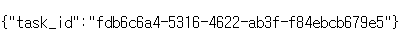
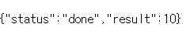

# Celery example

### 소개
FastAPI, Redis, celery 를 이용한 비동기 작업 큐 프레임워크 예제
단순계산은 redis 를 사용할 필요 없이 celery 만 사용해도 되지만 지금 처리하지 않고 나중에 처리해도 되는 작업을 백그라운드에서 처리하는 것이 주요 목적
- https://docs.celeryq.dev/en/latest/getting-started/introduction.html
- https://github.com/celery/celery/
```
pip install celery
```


- 시간이 오래 걸리는 작업을 비동기로 처리
    - 클라이언트 요청/응답은 빠르게, 처리 자체는 백엔드에서 따로
- 서버 부하 분산
    - 복잡한 연산은 큐에 넣어 워커(worker)가 대신 처리
- 재시도 / 실패 관리
    - celery 로 실패한 작업 자동 재시도
- 작업 스케줄링
    - 특정 작업을 주기적으로 실행 가능
- 멀티 워커 분산처리
    - 병렬 워커로 여러 작업을 동시에 실행 가능 (scale out)

---
### 구성 및 작업 흐름 요약

Producer (FastAPI 등): 작업 요청을 생성해서 큐에 전달

Broker (보통 Redis): 큐 역할, 메시지를 워커에게 전달

Worker (Celery): 큐에서 작업을 가져와 실행

Result Backend (보통 Redis): 작업 완료 후 결과 저장 (선택적)
```
[Client] → FastAPI → Celery(Task).delay() → Redis(Broker Queue)
                                                ↓
                                            [Celery Worker] 실행
                                                ↓
                                              결과 저장 → Redis(Result Backend)
```
- task 를 작업을 큐에 넣음 
    - task.delay() -> 간단 / 기본 호출 방식
    - task.apply() -> 즉시 실행 / 테스트 및 디버깅
    - task.apply_async() -> 세밀한 제어가 필요할때
        - countdown, eta, expires, priority 등

- Redis가 중간에서 메시지를 저장/중계하고

- Celery Worker가 Redis에서 메시지를 꺼내 실행

- 결과를 Redis 등에 저장해 나중에 조회 가능
---

### 실전에서 어디에 쓰는가
| 예시                 | 이유                                              |
|----------------------|---------------------------------------------------|
| 이메일 전송          | SMTP 전송이 느릴 수 있고, 실패 시 재시도 필요     |
| LLM 응답 처리        | GPT 등 호출 시 5초~20초 걸릴 수 있음             |
| 대용량 영상/파일 처리 | 처리 시간 수 분~수십분                            |
| 주기적 데이터 분석   | 예약 작업이나 대기열 필요                          |
| 알림 푸시/웹훅 처리  | 응답은 빠르게, 처리는 비동기로                    |

- 실시간 응답이 필요한 작업은 (계산기 결과, 로그인 응답, gpt 답변 등) celery 를 쓰면 복잡해진다. 그냥 엔드포인트에서 처리하는게 훨씬 더 좋음
- 실시간 응답이 필요없는 작업 등 사용자가 기다릴 필요 없이 나중에 돌아와서 결과를 확인해도 되는 작업은 celery 로 백그라운드에서 처리 후 결과 조회


---
### 간단한 테스트
1. 도커로 실행 (fastapi, redis, celery)
```
    docker-compose up --build
```

2. 작업 호출
 - celery 작업 아이디를 반환받는다.
```
    localhost:8000/add/2/5
```



3. 결과 확인
 - 반환받은 작업 아이디로 결과를 확인한다
 - 작업중일때는 pending 을 반환
```
    localhost:8000/result/{id}
```



 - api_test.py 에 간단한 테스트 코드 구현


### 그외 유용한 celery 기능들
https://docs.celeryq.dev/en/latest/getting-started/introduction.html#features
- Monitoring
- Scheduling
- Work-flows
- Resource Leak Protection
- Time & Rate Limits
- User Components

Task 인자값으로 여러 기능들을 추가할수 있다.
- https://docs.celeryq.dev/en/stable/userguide/tasks.html

### 설정
https://docs.celeryq.dev/en/stable/userguide/configuration.html#configuration